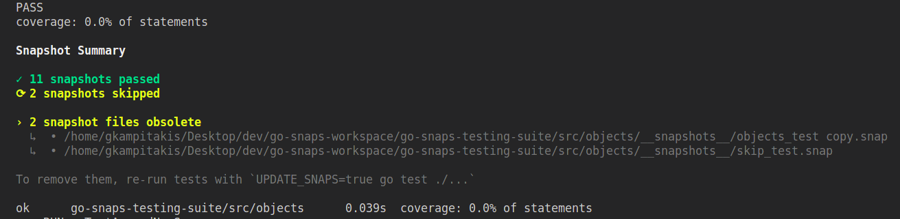
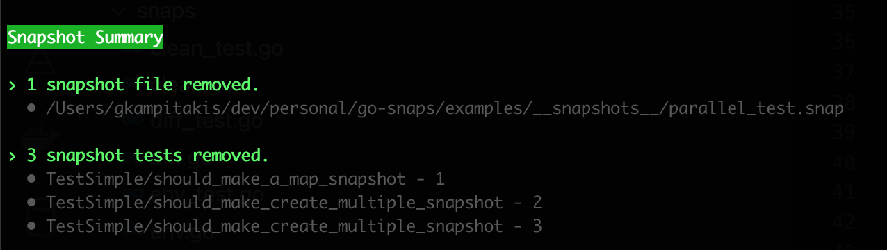

# Go Snaps

[](https://github.com/gkampitakis/go-snaps/actions/workflows/go.yml)
[](https://goreportcard.com/report/github.com/gkampitakis/go-snaps)
[](https://pkg.go.dev/github.com/gkampitakis/go-snaps)

<p align="center">
<b>Jest-like snapshot testing in Golang</b>
</p>

<br>

<p align="center">

</p>

## Contents

- [Installation](#installation)
- [MatchSnapshot](#matchsnapshot)
- [MatchJSON](#matchjson)
  - [Matchers](#matchers)
    - [match.Any](#matchany)
    - [match.Custom](#matchcustom)
    - [match.Type\[ExpectedType\]](#matchtype)
- [Configuration](#configuration)
- [Update Snapshots](#update-snapshots)
  - [Clean obsolete Snapshots](#clean-obsolete-snapshots)
  - [Sort Snapshots](#sort-snapshots)
  - [Skipping Tests](#skipping-tests)
- [Running tests on CI](#running-tests-on-ci)
- [No Color](#no-color)
- [Snapshots Structure](#snapshots-structure)
- [Acknowledgments](#acknowledgments)
- [Contributing](./contributing.md)
- [Appendix](#appendix)

## Installation

To install `go-snaps`, use `go get`:

```bash
go get github.com/gkampitakis/go-snaps
```

Import the `go-snaps/snaps` package into your code:

```go
package example

import (
  "testing"

  "github.com/gkampitakis/go-snaps/snaps"
)

func TestExample(t *testing.T) {
  snaps.MatchSnapshot(t, "Hello World")
}
```

## MatchSnapshot

`MatchSnapshot` can be used to capture any type of data structured or unstructured.

You can pass multiple parameters to `MatchSnapshot` or call `MatchSnapshot` multiple
times inside the same test. The difference is in the latter, it will
create multiple entries in the snapshot file.

```go
// test_simple.go

func TestSimple(t *testing.T) {
  t.Run("should make multiple entries in snapshot", func(t *testing.T) {
    snaps.MatchSnapshot(t, 5, 10, 20, 25)
    snaps.MatchSnapshot(t, "some value")
  })
}
```

`go-snaps` saves the snapshots in `__snapshots__` directory and the file
name is the test file name with extension `.snap`.

So for example if your test is called `test_simple.go` when you run your tests, a snapshot file
will be created at `./__snapshots__/test_simple.snaps`.

## MatchJSON

`MatchJSON` can be used to capture data that can represent a valid json.

You can pass a valid json in form of `string` or `[]byte` or whatever value can be passed
successfully on `json.Marshal`.

```go
func TestJSON(t *testing.T) {
  type User struct {
    Age   int
    Email string
  }

  snaps.MatchJSON(t, `{"user":"mock-user","age":10,"email":"mock@email.com"}`)
  snaps.MatchJSON(t, []byte(`{"user":"mock-user","age":10,"email":"mock@email.com"}`))
  snaps.MatchJSON(t, User{10, "mock-email"})
}
```

JSON will be saved in snapshot in pretty format for more readability and deterministic diffs.

### Matchers

`MatchJSON`'s third argument can accept a list of matchers. Matchers are functions that can act
as property matchers and test values.

You can pass a path of the property you want to match and test.

The path syntax is a series of keys separated by a dot. The dot and colon can be escaped with `\`.

Currently `go-snaps` has two build in matchers

- `match.Any`
- `match.Custom`
- `match.Type[ExpectedType]`

#### match.Any

Any matcher acts as a placeholder for any value. It replaces any targeted path with a
placeholder string.

```go
Any("user.name")
// or with multiple paths
Any("user.name", "user.email")
```

Any matcher provides some methods for setting options

```go
match.Any("user.name").
  Placeholder(value). // allows to define a different placeholder value from the default "<Any Value>"
  ErrOnMissingPath(bool) // determines whether the matcher will err in case of a missing, default true
```

#### match.Custom

Custom matcher allows you to bring your own validation and placeholder value

```go
match.Custom("user.age", func(val interface{}) (interface{}, error) {
		age, ok := val.(float64)
		if !ok {
				return nil, fmt.Errorf("expected number but got %T", val)
		}

		return "some number", nil
})
```

The callback parameter value for JSON can be on of these types:

```go
bool // for JSON booleans
float64 // for JSON numbers
string // for JSON string literals
nil // for JSON null
map[string]interface{} // for JSON objects
[]interface{} // for JSON arrays
```

If Custom matcher returns an error the snapshot test will fail with that error.

Custom matcher provides a method for setting an option

```go
match.Custom("path",myFunc).
  Placeholder(value). // allows to define a different placeholder value from the default "<Any Value>"
  ErrOnMissingPath(bool) // determines whether the matcher will err in case of a missing path, default true
```

#### match.Type

Type matcher evaluates types that are passed in a snapshot and it replaces any targeted path with a placeholder in the form of `<Type:ExpectedType>`.

```go
match.Type[string]("user.info")
// or with multiple paths
match.Type[float64]("user.age", "data.items")
```

Type matcher provides a method for setting an option

```go
match.Type[string]("user.info").
  ErrOnMissingPath(bool) // determines whether the matcher will err in case of a missing path, default true
```

You can see more [examples](./examples/matchJSON_test.go#L96).

## Configuration

`go-snaps` allows passing configuration for overriding

- the directory where snapshots are stored, _relative or absolute path_
- the filename where snapshots are stored
- programmatically control whether to update snapshots. _You can find an example usage at [examples](./examples/examples_test.go:14)_

```go
t.Run("snapshot tests", func(t *testing.T) {
  snaps.WithConfig(snaps.Filename("my_custom_name"), snaps.Dir("my_dir")).MatchSnapshot(t, "Hello Word")

  s := snaps.WithConfig(
    snaps.Dir("my_dir"),
    snaps.Filename("json_file"),
    snaps.Update(false)
  )

  s.MatchJSON(t, `{"hello":"world"}`)
})
```

You can see more on [examples](/examples/matchSnapshot_test.go#L67)

## Update Snapshots

You can update your failing snapshots by setting `UPDATE_SNAPS` env variable to true.

```bash
UPDATE_SNAPS=true go test ./...
```

If you don't want to update all failing snapshots, or you want to update only one of
them you can you use the `-run` flag to target the test(s) you want.

For more information on `go test` flags you can run

```go
go help testflag
```

### Clean obsolete snapshots

<p align="center">


</p>

`go-snaps` can identify obsolete snapshots.

In order to enable this functionality you need to use `TestMain(m *testing.M)` to
call `snaps.Clean(t)` after your tests have run. This will also print a **Snapshot Summary**. (if running tests
with verbose flag `-v`)

If you want to remove the obsolete snap files and snapshots you can run
tests with `UPDATE_SNAPS=clean` env variable.

The reason for using `TestMain` is because `go-snaps` needs to be sure that all tests
are finished so it can keep track of which snapshots were not called.

**Example:**

```go
func TestMain(m *testing.M) {
  v := m.Run()

  // After all tests have run `go-snaps` can check for unused snapshots
  snaps.Clean(m)

  os.Exit(v)
}
```

For more information around [TestMain](https://pkg.go.dev/testing#hdr-Main).

### Sort Snapshots

By default `go-snaps` appends new snaps to the snapshot file and in case of parallel tests the order is random. If you want snaps to be sorted in deterministic order you need to use `TestMain` per package:

```go
func TestMain(m *testing.M) {
  v := m.Run()

  // After all tests have run `go-snaps` will sort snapshots
  snaps.Clean(m, snaps.CleanOpts{Sort: true})

  os.Exit(v)
}
```

### Skipping Tests

If you want to skip one test using `t.Skip`, `go-snaps` can't keep track
if the test was skipped or if it was removed. For that reason `go-snaps` exposes
a wrapper for `t.Skip`, `t.Skipf` and `t.SkipNow`, which keep tracks of skipped files.

You can skip, or only run specific tests by using the `-run` flag. `go-snaps`
can identify which tests are being skipped and parse only the relevant tests
for obsolete snapshots.

## Running Tests on CI

When `go-snaps` detects that it is running in CI it will automatically fail when snapshots are missing. This is done to ensure new snapshots are committed alongside the tests and assertions are successful.

> `go-snaps` uses [ciinfo](https://github.com/gkampitakis/ciinfo) for detecting if it runs on CI environment.

## No Color

`go-snaps` supports disabling color outputs by running your tests with the env variable
`NO_COLOR` set to any value.

```bash
NO_COLOR=true go test ./...
```

For more information around [NO_COLOR](https://no-color.org).

## Snapshots Structure

Snapshots have the form

```text
[TestName - Number]
<data>
---
```

`TestID` is the test name plus an increasing number to allow multiple calls of `MatchSnapshot` in a single test.

```txt
[TestSimple/should_make_a_map_snapshot - 1]
map[string]interface {}{
    "mock-0": "value",
    "mock-1": int(2),
    "mock-2": func() {...},
    "mock-3": float32(10.399999618530273),
}
---
```

> [!NOTE]
> If your snapshot data contain characters `---` at the start of a line followed by a new line, `go-snaps` will "escape" them and save them as `/-/-/-/` to differentiate them from termination characters.

## Acknowledgments

This library used [Jest Snapshoting](https://jestjs.io/docs/snapshot-testing) and [Cupaloy](https://github.com/bradleyjkemp/cupaloy) as inspiration.

- Jest is a full-fledged Javascript testing framework and has robust snapshoting features.
- Cupaloy is a great and simple Golang snapshoting solution.
- The [logo](https://github.com/MariaLetta/free-gophers-pack) was made by [MariaLetta](https://github.com/MariaLetta).

## Appendix

> [!WARNING]
> When running a specific test file by specifying a path `go test ./my_test.go`, `go-snaps` can't track the path so it will mistakenly mark snapshots as obsolete.

> [!IMPORTANT]
> Snapshots should be treated as code. The snapshot artifact should be committed alongside code changes, and reviewed as part of your code review process
