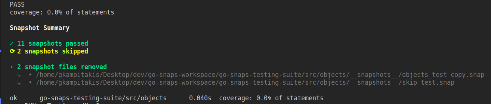

# Go Snaps

<p align="center">
<b>Jest-like snapshot testing in Golang</b>
</p>

<br>

<p align="center">


</p>

<br>

[](https://github.com/gkampitakis/go-snaps/actions/workflows/go.yml)

## Installation

To install `go-snaps`, use `go get`:

```bash
go get github.com/gkampitakis/go-snaps
```

Import the `go-snaps/snaps` package into your code:

```go
package example

import (
  "testing"

  "github.com/gkampitakis/go-snaps/snaps"
)

func TestExample(t *testing.T) {

  snaps.MatchSnapshot(t ,"Hello World")

}
```

### Usage

You can pass multiple parameters to `MatchSnapshot` or call `MatchSnapshot` multiple
times inside the same test. The difference is in the latter, it will
create multiple entries in the snapshot file.

```go

func TestSimple(t *testing.T) {

  t.Run("should make multiple entries in snapshot", func(t *testing.T) {
  
    snaps.MatchSnapshot(t, 5, 10, 20, 25)
    snaps.MatchSnapshot(t, "some value")
  
  })

}

```

`go-snaps` save the snapshots in `__snapshots__` directory and the file
name is the test file name with extension `.snap`.

So for example if your test is called `add_test.go` when you run your tests at the same
directory a new folder will be created `./__snapshots__/add_test.snaps`.

Finally you can update your failing snapshots with the cli flag `-snaps.update=true` 
or by setting `UPDATE_SNAPS` env variable to true.

```bash
go test ./... -snaps.update=true
# or
UPDATE_SNAPS=true go test ./...
```

You can also see some example usages in `./examples` in this project.

### Snapshots

Snapshots have the form 

`[ TestID ]`
<br>
`data`
<br>
`---`

`TestID` is the test name plus an increasing number ( allowing to do multiple calls
of `MatchSnapshot` inside a test ).

```txt
[TestSimple/should_make_a_map_snapshot - 1]
map[string]interface {}{
    "mock-0": "value",
    "mock-1": int(2),
    "mock-2": func() {...},
    "mock-3": float32(10.399999618530273),
}
---
```

### Clean obsolete snapshots

<p align="center">


</p>

`go-snaps` can identify obsolete snapshots.

In order to enable this functionality you need to use the `TestMain(t*testing.M)` 
and call `snaps.Clean()`. This will also print a **Snapshot Summary**.

If you want to remove the obsolete snap files and snapshots you can run 
tests with `UPDATE_SNAPS=true` env variable.

The reason for using `TestMain`, is because `go-snaps` needs to be sure that all tests 
are finished so it can keep track which snapshots were not called. 

**Example:**

```go
func TestMain(t *testing.M) {
  v := t.Run()

  // After all tests have run `go-snaps` can check for not used snapshots
  snaps.Clean()

  os.Exit(v)
}
```

For more information around [TestMain](https://pkg.go.dev/testing#hdr-Main).

#### Skipping Tests

If you want to skip one test using `t.Skip`, `go-snaps` can't keep track
if the test was skipped or if it was removed. For that reason `go-snaps` exposes 
a light wrapper for `t.Skip`, `t.Skipf` and `t.SkipNow` which help `go-snaps` identify
the skipped tests.

You can skip, or only run specific tests by using the `-run` flag. `go-snaps` 
can "understand" which tests are being skipped and parse only the relevant tests
for obsolete snapshots.

### Acknowledgments

This library used [Jest Snapshoting](https://jestjs.io/docs/snapshot-testing) and [Cupaloy](https://github.com/bradleyjkemp/cupaloy) as inspiration.

- Jest is a full-fledged Javascript testing framework and has robust snapshoting features.
- Cupaloy is a great and simple Golang snapshoting solution.

### Run examples

```bash
go test ./examples/... -v -count=1
```

### Notes

1. ⚠️ When running a specific test file by specifying a path
`go test ./my_test.go`, `go-snaps` can't track the path so it will mistakenly mark snapshots as obsolete.

2. The order in which tests are written might not be the same order that snapshots are saved in the file.

3. If your snapshot data contain the termination characters `---` at the start of a line
and after a new line, `go-snaps` will "escape" them and save them as `/-/-/-/`. This 
should not cause any diff issues (false-positives).

#### License 

MIT
